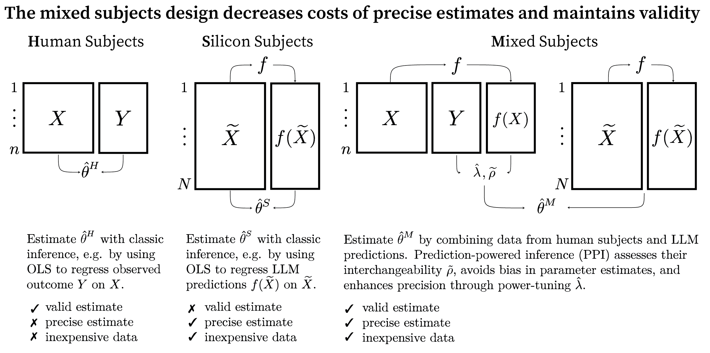

This GitHub repository provides the replication code and data for the journal article titled **"The Mixed Subjects Design: Treating Large Language Models as Potentially Informative Observations"**. Our two statistical contributions-the *PPI correlation* and the *PPI power analysis*-are implemented in the [ppi_py](https://github.com/aangelopoulos/ppi_py) Python library.

**Abstract:** Large Language Models (LLMs) provide cost-effective but possibly inaccurate predictions of human behavior. Despite growing evidence that predicted and observed behavior are often not *interchangeable*, there is limited guidance on using LLMs to obtain valid estimates of causal effects and other parameters. We argue that LLM predictions should be treated as potentially informative observations, while human subjects serve as a gold standard in a *mixed subjects design*. This paradigm preserves validity and offers more precise estimates at a lower cost than experiments relying exclusively on human subjects. We demonstrate-and extend-prediction-powered inference, a method that combines predictions and observations. We define the *PPI correlation* as a measure of interchangeability and derive the *effective sample size* for PPI. We also introduce a power analysis to optimally choose between *informative but costly* human subjects and *less informative but cheap* predictions of human behavior. Mixed subjects designs could enhance scientific productivity and reduce inequality in access to costly evidence.

**Keywords:** Mixed Subjects Design, Prediction-Powered Inference, PPI Correlation, Effective Sample Size, PPI Power Analysis, Moral Machine Experiment, Machine Learning, Large Language Models, Computational Social Science

 
Broska, David, Michael Howes, and Austin van Loon. 2024. “The Mixed Subjects Design: Treating Large Language Models as (Potentially) Informative Observations.” OSF. https://doi.org/10.31235/osf.io/j3bnt.

 

 

 

